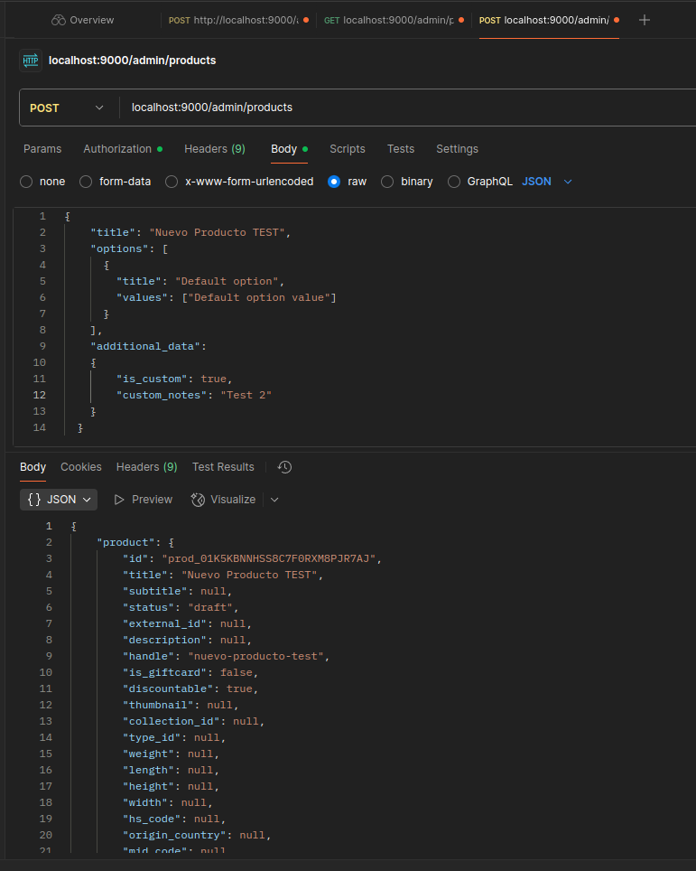
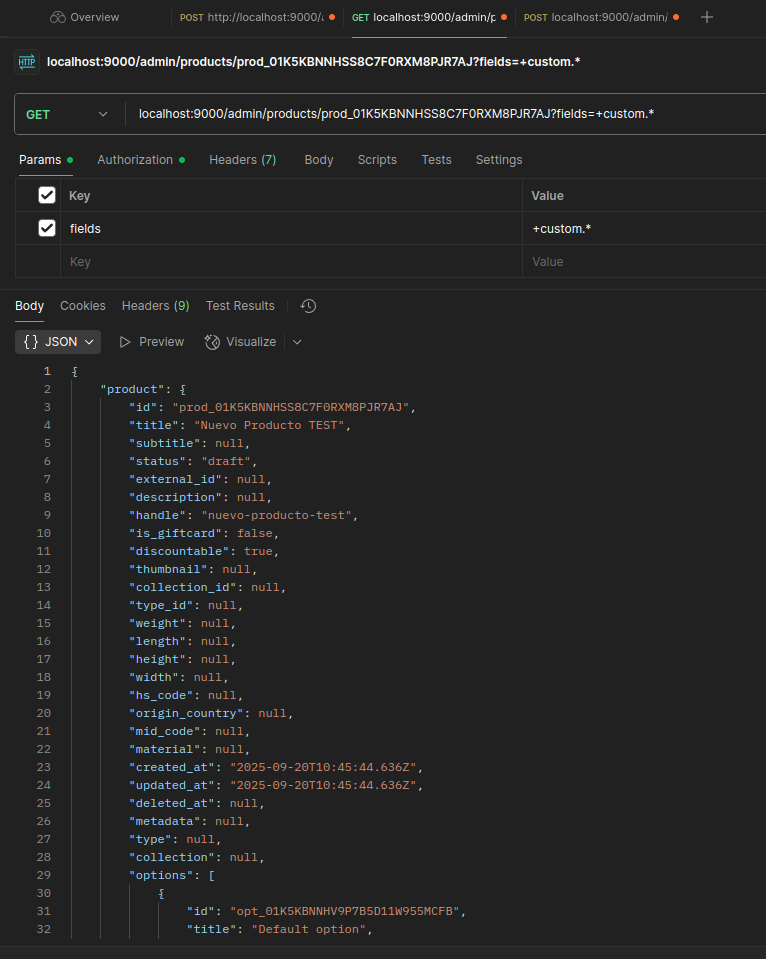
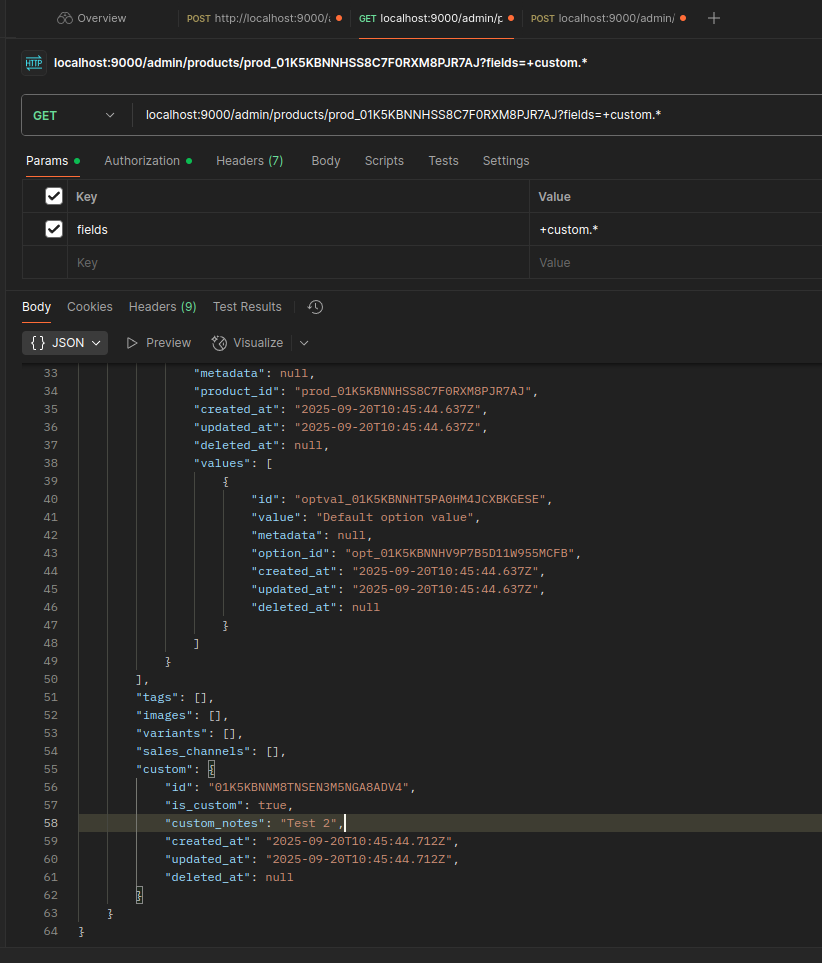
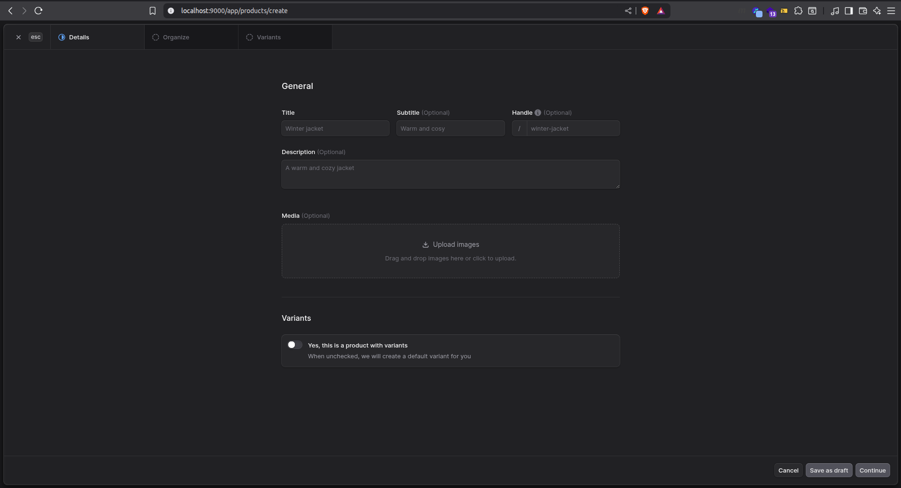
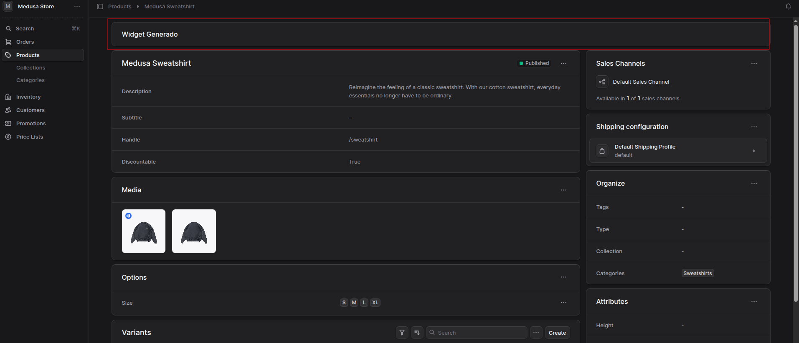
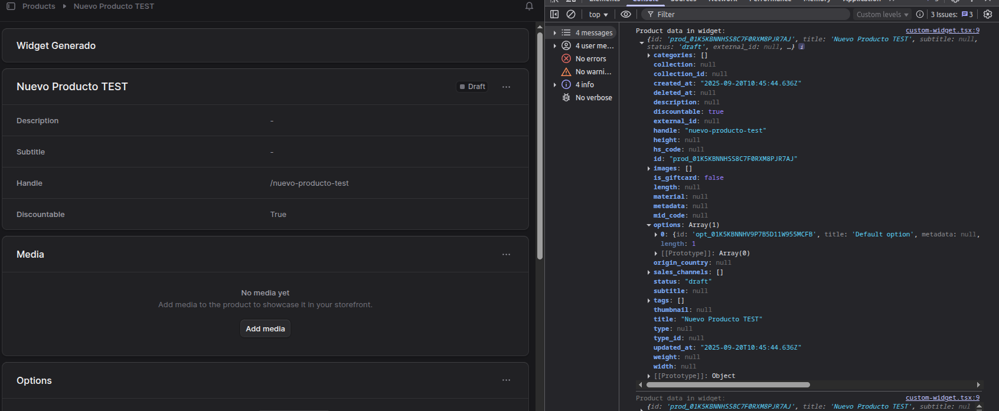
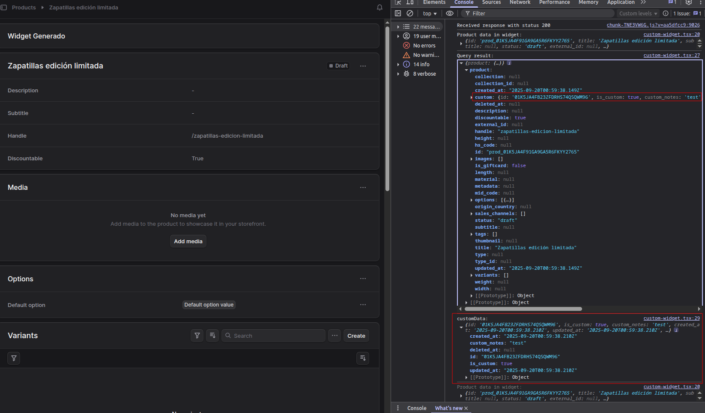

# Prueba Técnica Full-Stack - Medusa + Next.js

Este repositorio contiene la solución a una prueba técnica realizada como parte de un proceso de selección laboral de MyUrbanScoot.

## Descripción

El objetivo de este proyecto es demostrar habilidades técnicas y buenas prácticas de desarrollo según los requerimientos especificados en la oferta laboral.

## Tarea 1: Extensión del Modelo de Producto

En esta tarea se ha extendido el Modelo de Producto base que incluye Medusa.
Para ello se ha creado el fichero `mi-prueba-tecnica/src/modules/custom/models/custom.ts` el cual va a contener las propiedades que añadimos al modelo.

1. Creamos el Modulo Custom
2. Creamos el Modelo Custom

```ts
import { model } from "@medusajs/framework/utils"

const Custom = model.define("custom", {
  id: model.id().primaryKey(),
  is_custom: model.boolean(),
  custom_notes: model.text(),
})

export default Custom;
```

3. Generamos el link
4. Generamos y corremos la migración
```bash
npx medusa db:generate custom
npx medusa db:migrate
```

Esto nos crea en la base de datos la tabla `product_product_custom_custom`

5. Creamos el **middleware**. En el vamos a poder modificar los datos que esperamos recibir en cada ruta. En este caso se añade:
```ts
routes: [
    {
      method: "POST",
      matcher: "/admin/products",
      additionalDataValidator: {
        is_custom: z.boolean().optional(),
        custom_notes: z.string().optional(),
      },
    },
  ],
```
6. Creamos el workflow y los pasos
7. Creamos el index del workflow
8. Usamos el hook de `product-created` para realizar la inserción del elemento custom y linkearlo.
9. Realizamos las pruebas desde **Postman**. Generamos una llamada POST donde le pasemos `additional_data` con los campos que creamos. Y luego realizamos una llamada GET para obtener el producto recien creado y ver si nos devuelve el contenido de la tabla `custom` con la relación.

**Llamada POST:**

**Llamada GET:**



## Tarea 2: Widget en Medusa Admin

En esta tarea añadiremos un widget al panel de administrador de Medusa para controlar los campos creados en la tarea anterior.

Actualmente el panel se muestra de esta forma:



Para empezar a crear nuestro widget será necesario crear el fichero `mi-prueba-tecnica/src/admin/widgets/custom-widget.tsx`.

En el export default de esta página será donde se situara el elemento React de nuestro widget. En las opciones, indicaremos la zona. En este caso al ser un widget para los detalles del producto lo situaremos en `product.details.before`. Además lo dibujaremos en la parte superior de la página para tenerlo más a la vista.



Ya tenemos el widget en el panel, ahora hay que hacer que realice las funciones que queremos.
Para ello, los widgets reciben un objeto por props de `data`, primero es necesario ver el contenido de este objeto.

En nuestro widget realizamos el siguiente `console.log()`:
```tsx
const ProductWidget = ({ data }: DetailWidgetProps<AdminProduct>) => {
  console.log("Product data in widget:", data)
  return (
    <Container className="divide-y p-0">
      <div className="flex items-center justify-between px-6 py-4">
        <Heading level="h2">Widget Generado</Heading>
      </div>
    </Container>
  )
}
```
Pero como se puede observar, los datos custom no llegan en esta `data`:


Para ello necesitamos primero crear el sdk, con él podemos lanzar solicitudes al servidor de Medusa.
Creamos el fichero `mi-prueba-tecnica/src/admin/lib/sdk.ts` con el siguiente contenido:

```ts
import Medusa from "@medusajs/js-sdk"

export const sdk = new Medusa({
  baseUrl: import.meta.env.VITE_BACKEND_URL || "/",
  debug: import.meta.env.DEV,
  auth: {
    type: "session",
  },
})
```

Finalmente, realizamos la solicitud en nuestro widget:

```ts
const { data: queryResult } = useQuery({
  queryFn: () => sdk.admin.product.retrieve(data.id, {
    fields: "+custom.*",
  }),
  queryKey: [["product", data.id]],
})
```

Ahora si, si mostramos el resultado de la query por consola, podemos observar como si que se obtiene el campo `custom` relacionado.



Añadimos al widget un botón para guardar la información, y realizamos la llamada correspondiente.

```ts
const { mutate: saveCustom } = useMutation({
  mutationFn: async () => {
    if (!customData?.id) return
    return sdk.client.fetch(`/admin/custom/${customData.id}`, {
      method: "POST",
      body: {
        is_custom: isCustom,
        custom_notes: customNotes,
      },
    })
  },
  onSuccess: () => {
    toast.success("Success!", {
        description: "Custom actualizado correctamente",
      })
    queryClient.invalidateQueries({ queryKey: [["product", data.id]] })
  },
  onError: () => {
    toast.error("Error!", {
        description: "Error al actualizar el custom",
      })
  },
})
```

y para ello se ha creado la API route:

```ts
// mi-prueba-tecnica/src/api/admin/custom/[id]/route.ts
import { MedusaRequest, MedusaResponse } from "@medusajs/framework/http"
import CustomModuleService from "../../../../modules/custom/service"

export const POST = async (req: MedusaRequest, res: MedusaResponse) => {
  const { id } = req.params
  const customService: CustomModuleService = req.scope.resolve("custom")

  const updated = await customService.updateCustom(id, req.body)

  res.json({ custom: updated })
}
```

y se ha añadido la función en el service:

```ts
// mi-prueba-tecnica/src/modules/custom/service.ts
class CustomModuleService extends MedusaService({
  Custom,
}) {

  async updateCustom(id: string, data: any) {
    return this.updateCustoms([
      {
        id,
        ...data,
      },
    ])
  }
}
```

## Tarea 3. Sistema de Eventos y Subscriber

En esta tarea realizaremos un sitema que reaccione a los cambios realizados en los campos personalizados.

Lo primero que necesitamos hacer es crear nuesto Subscriber.

```ts
// mi-prueba-tecnica/src/subscribers/custom-changed.ts
import {
  type SubscriberConfig, type SubscriberArgs
} from "@medusajs/framework"

// subscriber function
export default async function customChangedHandler({
  event: { data },
  container,
}: SubscriberArgs<{ id: string }>) {
  console.log("[SUBSCRIBER] A product's custom data was changed")
  const productId = data.id

  const customModuleService = container.resolve("custom")

  const custom = await customModuleService.retrieveCustom(productId)

  console.log(`[SUBSCRIBER]The custom ${custom.id} was modified!`)
}

// subscriber config
export const config: SubscriberConfig = {
  event: "product.custom_changed",
}
```

Y realizaremos la llamada al disparador desde el `service` de nuestro custom. En él, añadiremos la función `emit()` que se encargará de disparar los eventos que recogerá el subscriber:

```ts
// mi-prueba-tecnica/src/modules/custom/service.ts
async emit<T>(data: Message<T> | Message<T>[], options: Record<string, unknown>): Promise<void> {
    const events = Array.isArray(data) ? data : [data]

    for (const event of events) {
      console.log(`[Service Custom]Received the event ${event.name} with data ${event.data}`)

      if (event.metadata?.eventGroupId) {
        const groupedEvents = this.groupedEventsMap_.get(
          event.metadata.eventGroupId
        ) || []

        groupedEvents.push(event)

        this.groupedEventsMap_.set(event.metadata.eventGroupId, groupedEvents)
        continue
      }


      await this.eventBusService_.emit(event, options)
    }
  }
```

Finalmente modificamos un custom y observamos por consola si el evento ha sido recibido por el subscriber:

```bash
[Service Custom]Received the event product.custom_changed with data [object Object]
info:    Processing product.custom_changed which has 1 subscribers
[SUBSCRIBER] A product's custom data was changed
http:    POST /admin/custom/01K5JA4FB23ZFDRHS74QSQWM96 ← http://localhost:9000/app/products/prod_01K5JA4F91GA9GA5R6FKYY2765 (200) - 3.112 ms
[SUBSCRIBER]The custom 01K5JA4FB23ZFDRHS74QSQWM96 was modified!
```

## Tarea 4 - Visualización en Storefront

En esta última tarea tendremos que indicar de forma visual las opciones de customización que se han habilitado anteriormente.

Lo primero que tenemos que hacer es obtener el campo `custom` en nuestra llamada al backend. Para ello lo único que tenemos que hacer es modificar la llamada `fetch` que realizamos, y añadir el campo que queremos recuperar:

```ts
.fetch<{ products: HttpTypes.StoreProduct[]; count: number }>(
  `/store/products`,
  {
    method: "GET",
    query: {
      limit,
      offset,
      region_id: region?.id,
      fields:
        "*variants.calculated_price,+variants.inventory_quantity,+metadata,+tags,+custom.*", // <-- Campo custom Añadido
      ...queryParams,
    },
    headers,
    next,
    cache: "force-cache",
  }
)
```

Ahora también sería necesario mostrar las notas dentro de la vista detallada del producto. Para ello creamos un nuevo componente. El cual comprobará si el producto tiene el flag de `is_custom` activado, y si es así dibujará el componente, si no, no.
```ts
// mi-prueba-tecnica-storefront/src/modules/products/components/product-custom/index.tsx
"use client";

type ProductCustomProps = {
  custom: {
    is_custom: boolean
    custom_notes?: string
    [key: string]: any
  } | null
}

export default function ProductCustom({ custom }: ProductCustomProps) {
  if (!custom?.is_custom) {
    return null
  }

  return (
    <div className="border border-gray-300 rounded-md p-4 mt-4">
      <h2 className="text-lg font-semibold mb-2">Custom Product Details</h2>
      <p>{custom.custom_notes || "N/A"}</p>
    </div>
  )
}
```

Finalmente, para indicar desde la vista del listado de productos si el producto es custom añadiremos un indicador. Para ello modificaremos el componente `product-preview` y añadiremos lo siguiente:

```tsx
{product.custom?.is_custom && (
  <div className="absolute top-2 left-2 bg-ui-primary text-ui-primary-inverse w-6 h-6 rounded-full flex items-center justify-center text-xs z-10 bg-red-500 " />
)}
```

Los resultados son los siguientes:


